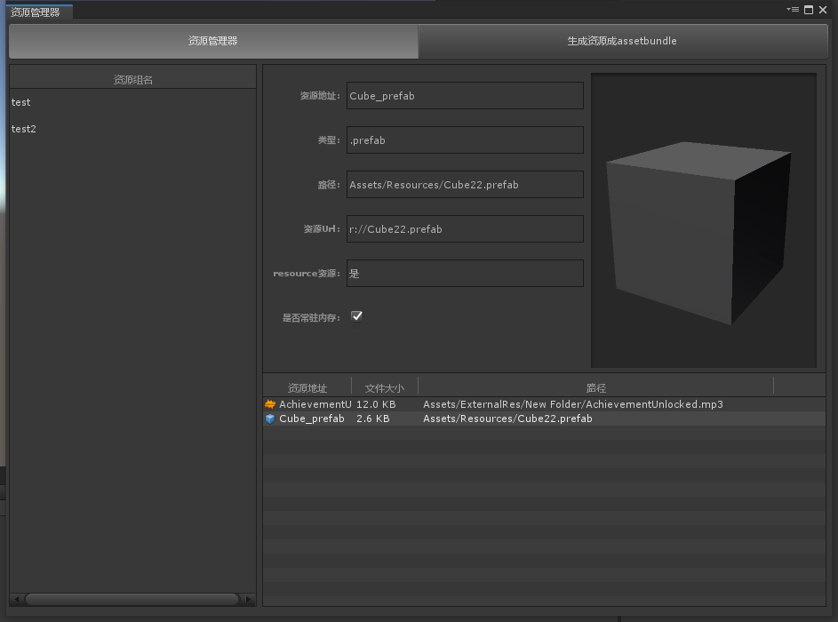
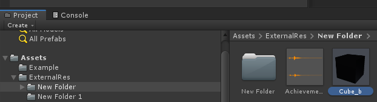
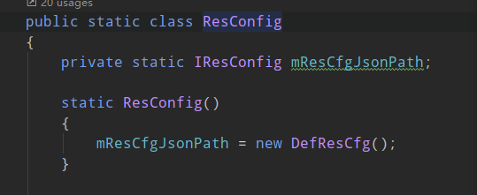
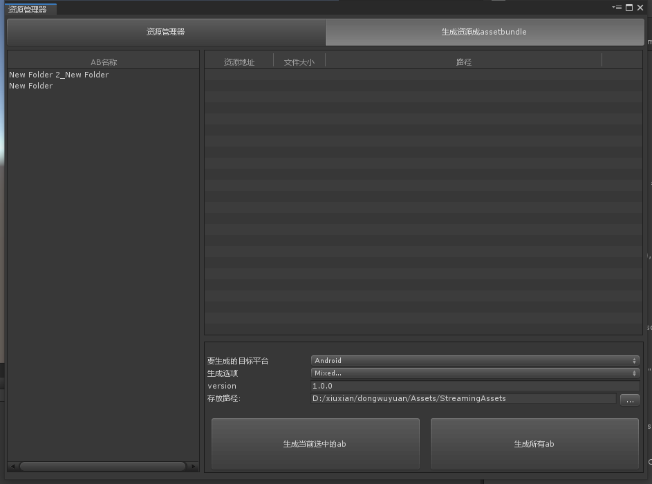
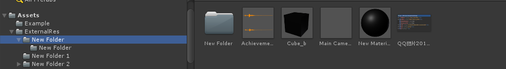
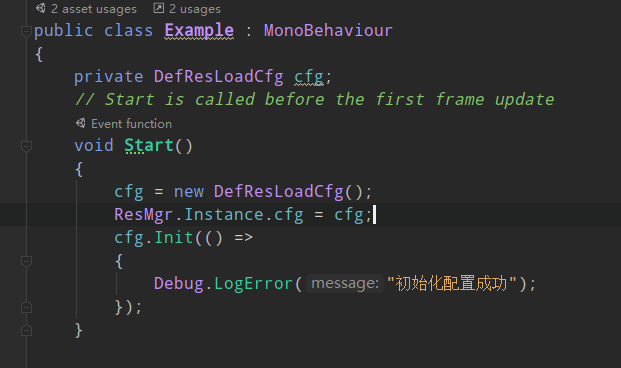

# 资源管理器

## 编辑功能

> 对资源进行编组，可以资源可以按组进行加载，不用操心资源来源于那些assetbundle，通过资源管理器可以让每个资源生成唯一地址，当资源移动删除等操作的时候会自动把资源重新链接到新的资源，同时支持编辑器下使用打包和不打包assetbundle的方式进行，可以随时切换。

资源加载方式可以由你自己自定义

## 编辑器使用

从window/ResMgr 菜单栏呼出界面
> 
> 资源管理器界面


### 资源管理器界面

**资源组**: 
在资源管理器的左侧是资源组管理
右键点击左侧的空白位置可以添加一个新的资源组，资源组名字都是唯一的，单击可以选中资源，选中后右键可以改名可以删除

**资源信息**: 
右侧上半部分是你当前选中的资源组里面选中的资源信息目前只能 更改`资源是否常驻内存`
>`特别说明:` 资源的url生成规则为 resource下的url为r://folderName/1.prefab 这样的格式   ab目录下的以外部文件夹路径为根路径
>例如：
>Cube_b.prefab的url为 e://New Folder/Cube_b.prefab

**资源列表**：
右侧下半部分是你选中的资源组里面包含的资源列表
双击资源列表里面的资源可以选中工程里面的文件
两次单击可以修改资源的唯一地址，添加时默认的资源地址为 资源名_资源名后缀

> ` 注意:`
> 资源地址是全局唯一的
> 当勾选常驻内存后资源将永远不会释放


**添加资源 **： 可以选中资源组后把资源往资源列表的空白处拖可以把你拖进来的资源添加到资源组，也支持拖入文件夹

> `注意：` 拖入文件夹的时候只会把当前文件夹下的资源添加到资源组，不会添加子文件资源

### 编辑器自定义接口 
YKFramwork.ResMgr.Editor.IResConfig 
``` cs
string JsonFilePath { get; } //资源json文件保存路径
string ExternalResDir { get; } //要打包成assetbundle的外部文件夹
List<Type> CanDropType { get; } //能忘资源管理里面拖的文件类型
```

你可以自行实现接口然后修改resconfig里面用你的类而不用默认的


默认有一个默认实现

### 生成资源界面
> 


左侧为编辑器所引用到的资源的ab

右侧为选中的ab里面包含的资源信息

> AB 为每个目录会生成一个ab
> 比如下图资源结构:
> 
>> 就会生成： 
> new folder.bytes ->包含  cube_b mainCame... 等等 (前提是资源管理器添加了这个资源不然不会被打包到ab)
> new folder_new folder.bytes
> new folder 1.bytes
>new folder 2.bytes

>` 注意：` ab名字会以ExternalResDir 为根目录  然后把所有的/换成_为名字

## 资源加载
添加ResMgr脚本到你的场景游戏物体上注意切换场景不能删除

实现YKFramwork.ResMgr.IResLoadCfg 来自定义你的加载设置

```
  bool SimulateAssetBundle { get; } //是否打开编辑器下ab加载方式
  ResJsonData ResData { get; }//资源配置表数据 //这个需要自己先加载好
  string RootABPath { get; } //ab存放的根目录
  string RootABUrl { get; } //ab存放的目录的url
  string AssetBundleVariant { get; }//ab的后缀名称
```
同样这个也有一个默认实现 YKFramwork.ResMgr.DefResLoadCfg你可以编写自己的config

怎么使用 

先进行配置表初始化

初始化后就可以使用  resmgr 的Api了


### 主要 API 说明

YKFramwork.ResMgr.ResMgr：
```
HasAsset(string address) //判断资源是否在内存中

GetRes(string address) //同步获取一个资源，这个资源必须是加载过的否则报错
GetResByUrl(string url)//和上一个一样只是使用url进行获取

GetResAsync(string address, Action<UnityEngine.Object> callback) //异步获取一个资源，这个资源可以是没有加载过得

GetResAsyncByUrl (string url, Action<UnityEngine.Object> callback) //和上一个相同只是使用url

LoadGroup(string groupName, Action<string> completed, Action<float, string> itemCompleted)//加载一组资源 参数分别为 资源组名称，加载完成，加载完单个资源的回调包含进度和当前加载出来的资源名


LoadForResource(string addr, Action<UnityEngine.Object> callback)//加载一个resource下的资源
LoadForResourceByUrl(string url, Action<UnityEngine.Object> callback)//同上


LoadForAB(string addr, Action<UnityEngine.Object> callback,bool releaseAB = false)//从ab里面加载一个资源  releaseAB标志为加载后是否释放掉ab

Release(string addr, bool force = false)//释放一个资源 force 强制释放，不管有没有其他地方引用强制卸载

UnloadUnused() //调用这个函数来释放所有不是常驻内存的资源
```

**接口：**

```
YKFramwork.ResMgr.IAssetBundleLoad 加载ab的实现

调用YKFramwork.ResMgr.ResMgr.Instace.ABMgr =  new DefAssetBundleLoad(); 来设置
默认实现为 YKFramwork.ResMgr.DefAssetBundleLoad


YKFramwork.ResMgr.IResourceLoad 加载resource的实现
调用YKFramwork.ResMgr.ResMgr.Instace.ResourceLoad =  new DefResourceLoad(); 来设置
默认实现为 YKFramwork.ResMgr.DefResourceLoad


YKFramwork.ResMgr.IResLoadCfg 加载的配置信息
调用  cfg = new DefResLoadCfg();
        ResMgr.Instance.cfg = cfg;
默认实现 YKFramwork.ResMgr.DefResLoadCfg
```
## 案例
在Example文件夹下有案例场景和脚本


